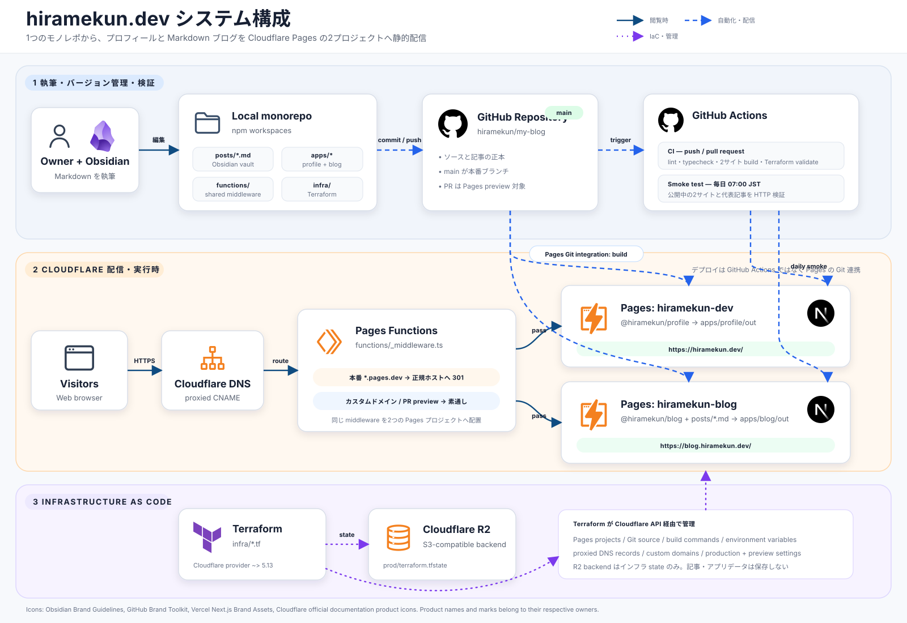

# hiramekun.dev

`hiramekun.dev` 配下のサイトをまとめたモノレポ。Cloudflare Pages でホストし、
インフラは `infra/` の Terraform で作る。

| | URL | 中身 |
|---|---|---|
| プロフィール | <https://hiramekun.dev/> | 自己紹介と各種リンク集。ここが入口 |
| ブログ | <https://blog.hiramekun.dev/> | 技術・教育・社会について考えたことを書く場所 |
| 技術ノート | <https://notes.hiramekun.dev/> | 別リポジトリ（[tech-notes](https://github.com/hiramekun/tech-notes)） |

## システム構成



実行時・デプロイ・IaC の経路とアイコンの出典は、[システム構成の説明](docs/system-architecture.md)を参照。

## 構成

```
├── apps/
│   ├── profile/            # hiramekun.dev — リンク集。リンクは src/lib/links.ts に集約
│   │   └── src/
│   └── blog/               # blog.hiramekun.dev — 記事一覧・記事・アーカイブ・カテゴリ
│       └── src/
│           ├── app/        # App Router のページ
│           ├── components/ # Header / Sidebar / PostCard / PageLayout
│           └── lib/        # posts.ts(記事の読み込み) / metadata.ts / sites.ts
├── packages/
│   └── theme/              # 2 サイト共通の Material Design 3 デザイントークン
│                           # theme.css = トークン / globals.css = コンポーネント
├── posts/                  # 記事の Markdown（Obsidian の vault をそのまま使う）
├── functions/              # Pages Functions。pages.dev を正規ホストへ 301 する
├── infra/                  # Terraform（Pages プロジェクト 2 つ + DNS）
└── docs/setup-cloudflare.md
```

記事の Markdown をリポジトリ直下の `posts/` に置いたままにしてあるのは、
Obsidian の vault がそこを指しているため。`apps/blog` のビルドが 2 階層上を読む。

## 開発

```bash
npm install

npm run dev:blog      # http://localhost:3000/
npm run dev:profile   # http://localhost:3001/
```

`basePath` は使っていないので、どちらもルートで配信される
（GitHub Pages 時代の `/my-blog` は廃止した）。

```bash
npm run build         # 2 サイトとも静的出力を作る
npm run lint
npm run typecheck     # 2 サイト + Pages Functions
```

## 記事を書く

`posts/記事名.md` を作る。

```markdown
---
title: "記事タイトル"
date: "2025-07-24"
excerpt: "記事の概要"
tags: ["tag1", "tag2"]
---

本文を Markdown で書く
```

`date` は `YYYY-MM-DD`。ファイル名がそのまま URL（`/posts/記事名/`）になる。

## リンクを増やす

プロフィールページに載せるリンクは `apps/profile/src/lib/links.ts` の `LINKS` に集約してある。
自分のサイトも外部サービスのアカウントも同じカードで並べるので、
`title` / `description` / `href` を 1 行足せばそのまま出る。

ロゴは使わず**サービス名のテキスト**で出す方針。理由は
[docs/third-party-logos.md](docs/third-party-logos.md)。

## デプロイ

`main` への push を Cloudflare Pages の Git 連携が見て、2 つのプロジェクトが
それぞれビルドする。GitHub Actions が行うのはビルド確認（`ci.yml`）と
公開後の死活監視（`smoke-test.yml`）だけで、デプロイはしない。

PR にはプレビューデプロイが付く。`functions/_middleware.ts` が 301 で弾くのは
本番の `<project>.pages.dev` だけなので、`<hash>.<project>.pages.dev` はそのまま開ける。

初期設定は [docs/setup-cloudflare.md](docs/setup-cloudflare.md) を参照。

## デザイン

Material Design 3。**トークンは [tech-notes](https://github.com/hiramekun/tech-notes/blob/main/app/theme.css)
と同じもの**を使い、3 サイトの見た目を揃えている（ソースカラー `#B8E36B` から
SchemeTonalSpot で生成した値）。向こうを更新したらこちらにも反映する。

- `packages/theme/theme.css` — 色・タイポグラフィ・シェイプ・エレベーション・モーションのトークン。
  `prefers-color-scheme` でライト／ダークが切り替わる
- `packages/theme/globals.css` — ベーススタイルと M3 コンポーネント（ボタン / チップ / カード）。
  コンポーネントの語彙も tech-notes に合わせてある
- `apps/blog/src/app/globals.css` — 記事本文（`.prose`）。tech-notes の `.card-content` と同じ組み方

クラスはすべて `@layer base` / `@layer components` に入れてあるので、
`md-button hidden` のように Tailwind のユーティリティを併記するとユーティリティが勝つ。

フォントは webfont を読まず、`--md-sys-typescale-plain-font` のスタックに任せる。
シンタックスハイライトも highlight.js のテーマ CSS ではなく `--note-code-*` を使うので、
ライト／ダークの両方で読める。

UI を変えたら `verify-site` skill でローカルの表示を目視確認する。
